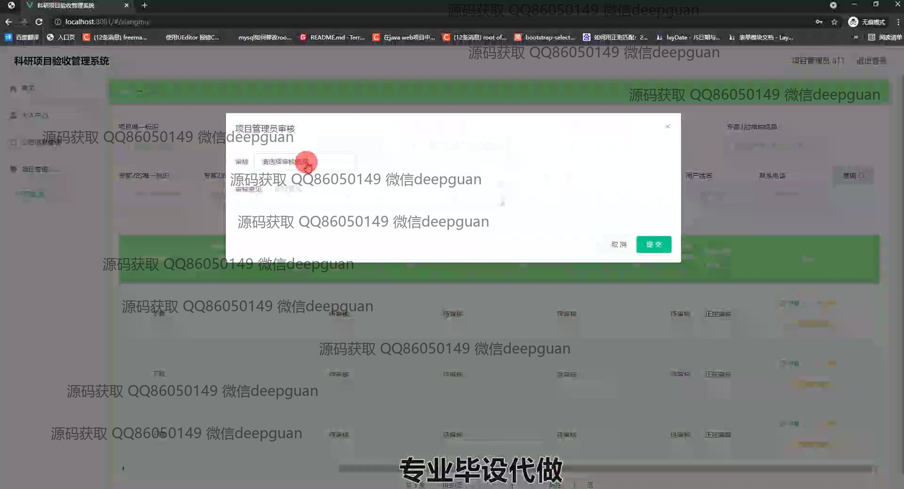

<h1 align="center">科研项目验收管理系统</h1>

## 简介
科研项目验收管理系统：角色分为管理员、专家、项目管理员和验收员，功能包括项目管理、用户管理、审核流程、文件上传和公告信息管理。系统旨在提高科研项目验收的管理效率和信息处理的便捷性。    --计算机毕业设计源码；毕设源码；java毕业设计源码

## 联系方式

<h3 align="center">获取完整代码与数据库文件 + 微信：deepguan QQ: 86050149 QQ群: 783742310</h3>

<h3 align="center">可帮忙远程部署 包运行成功！提供远程部署、修改代码、设计文档指导、代码讲解等服务！</h3>

## 功能介绍（完整见运行截图）
管理员：管理员可以通过登录界面进入系统，进行研究项目的整体管理，包括项目的添加、删除、编辑等高级别操作。管理员可以访问和管理用户账户，分配角色和权限。项目管理模块允许管理员浏览所有项目，查看详细信息，并创建公告和项目文件以支持管理和沟通。管理员还有权限查看审核日志，管理系统设置，更新系统公告，以确保信息的准确流通和项目的进展跟踪。

项目管理员：项目管理员负责管理分配给他们的项目，通过系统可以查看项目信息、管理项目进度、上传必要文件，并与专家和验收员进行协作。项目管理员可以查看专家的审核意见，选择不同的审核结果并提交审核信息。他们有权利进入进行项目文件的管理和公告信息的更新，并可利用条件筛选功能搜寻特定项目，从而优化项目管理效率。

验收员：验收员在系统中主要负责项目验收环节。他们通过系统访问需要验收的项目，对项目的验收文件进行查看和上传审核记录。验收员可以在专家审核模块中输入和提交他们的验收意见，也可以对项目公告进行管理和查阅。他们通过系统的导航功能，在项目验收过程中以查看不同项目的状态，确保验收的流程顺畅进行。

专家：专家通过系统登录后，进入项目审核模块，对分配给自己的项目进行评审。他们可以查看项目详细信息和上传的相关文档，填写审核意见并提交结果。专家拥有查看不同项目状态和下载项目资料的权限，还可以通过筛选功能便捷地找到需要审核的项目。系统提供的直观界面和操作流程，使专家能够高效完成审核任务。

## 运行截图

本代码来源于网络,仅供学习参考使用!

